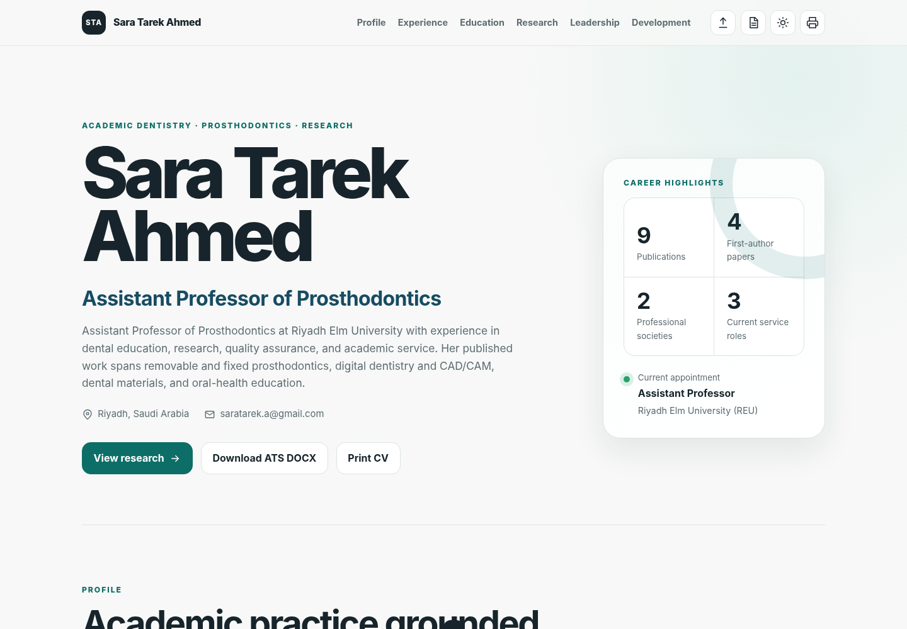

# Sara Tarek Ahmed — Digital CV

A structured CV publishing workflow that uses an Excel workbook as the editable source of truth, exports the data to JSON, renders a responsive web CV, and generates an ATS-friendly Word document.

<p align="center">
  <a href="https://itzmorphinetime.github.io/SaraCV/">
    <strong>View the live CV website</strong>
  </a>
</p>

<p align="center">
  <a href="https://itzmorphinetime.github.io/SaraCV/">
    
  </a>
</p>

## Live website

The published CV is available through GitHub Pages:

**[https://itzmorphinetime.github.io/SaraCV/](https://itzmorphinetime.github.io/SaraCV/)**

The webpage loads its content from the repository JSON file at runtime, so CV content can be updated without rewriting the HTML.

## Repository files

```text
.
├── Index.html
├── SaraExportedDataCV.json
├── Sara_Tarek_Ahmed_CV_Master_Dataset_with_JSON_Exporter.xlsx
├── Sara_Tarek_Ahmed_ATS_CV.docx
├── Sara_Tarek_Ahmed_CV_ATS_Button_Preview.png
└── README.md
```

| File | Purpose |
|---|---|
| `Sara_Tarek_Ahmed_CV_Master_Dataset_with_JSON_Exporter.xlsx` | Human-editable master dataset containing CV records, verification states, privacy rules, and output settings. |
| `SaraExportedDataCV.json` | Machine-readable data exported from the workbook and consumed by the website. |
| `Index.html` | Responsive GitHub Pages CV that dynamically renders the JSON data. |
| `Sara_Tarek_Ahmed_ATS_CV.docx` | Current ATS-friendly Word CV generated from the structured dataset. |
| `Sara_Tarek_Ahmed_CV_ATS_Button_Preview.png` | Repository preview image showing the webpage and ATS DOCX export interface. |

## Workflow overview

```text
Excel master dataset
        │
        │  Office Script export
        ▼
SaraExportedDataCV.json
        │
        ├──────────────► Index.html
        │                 GitHub Pages CV
        │
        └──────────────► ATS DOCX exporter
                          Professional Word CV
```

The Excel workbook is the authoritative source. The JSON, website, and Word document are generated outputs.

## Updating the CV

### 1. Edit the master workbook

Open:

```text
Sara_Tarek_Ahmed_CV_Master_Dataset_with_JSON_Exporter.xlsx
```

Update the relevant structured sheet rather than editing the generated JSON, HTML, or DOCX directly.

The workbook stores:

- profile and contact information;
- education;
- employment;
- publications;
- intellectual property;
- committee and academic-service roles;
- professional memberships;
- community projects;
- professional development;
- unresolved issues and editorial decisions.

Each record includes:

- a stable record ID;
- raw and cleaned values;
- verification status;
- source-page references;
- privacy settings;
- web, employer-CV, and academic-CV inclusion flags.

### 2. Review privacy and inclusion settings

Before exporting, confirm the following fields:

```text
Privacy
Include Web
Include Employer CV
Include Academic CV
Status
```

Only approved public information should be enabled for the website.

Private addresses, unverified claims, incomplete records, and employer-only details should remain excluded from the public output.

### 3. Resolve outstanding issues

Use the workbook's **Issues & Decisions** sheet to track ambiguous dates, missing information, wording corrections, and approval decisions.

When an item is resolved:

1. update the linked record;
2. record the final decision;
3. change the issue status to `Resolved`;
4. change the related record status to `Verified`.

This preserves an auditable maintenance history.

### 4. Export the JSON

Use the workbook's **JSON Export** sheet and Office Script.

The exporter:

- reads the structured Excel tables;
- applies the configured mappings;
- preserves the expected schema;
- writes the generated JSON to the output sheet;
- returns the complete JSON string.

Save the exported file as:

```text
SaraExportedDataCV.json
```

The filename must remain unchanged because the webpage loads it directly.

### 5. Test the website locally

`Index.html` and `SaraExportedDataCV.json` must remain in the same directory.

Run a local server from the repository root:

```bash
python -m http.server 8000
```

Open:

```text
http://localhost:8000/Index.html
```

Review:

- profile and contact details;
- section ordering;
- publication links;
- privacy filtering;
- desktop and mobile layouts;
- print styling;
- ATS DOCX export;
- browser console errors.

### 6. Generate the ATS CV

Open the webpage and select **Download ATS DOCX**.

The DOCX is generated directly from the active JSON dataset rather than converted from the visual HTML layout.

This produces a document with:

- a single-column reading order;
- conventional section headings;
- standard paragraphs and bullet lists;
- no text boxes, sidebars, or decorative tables;
- selectable text;
- visible DOI text and hyperlinks;
- employer-specific inclusion settings;
- contact details in the main document body.

After generating the document:

1. open it in Microsoft Word;
2. review page breaks and section selection;
3. confirm dates and contact details;
4. run spelling and grammar checks;
5. test hyperlinks;
6. save the approved version as:

```text
Sara_Tarek_Ahmed_ATS_CV.docx
```

### 7. Commit and publish

Commit the updated source and generated files:

```bash
git add   Sara_Tarek_Ahmed_CV_Master_Dataset_with_JSON_Exporter.xlsx   SaraExportedDataCV.json   Sara_Tarek_Ahmed_ATS_CV.docx   Index.html   README.md

git commit -m "Update CV data and generated outputs"
git push
```

GitHub Pages will publish the updated website after the deployment completes.

## Data maintenance rules

### Use the workbook as the source of truth

Permanent content changes should originate in the Excel workbook.

Avoid making standalone content edits only in:

- `SaraExportedDataCV.json`;
- `Index.html`;
- `Sara_Tarek_Ahmed_ATS_CV.docx`.

Those changes may be overwritten during the next export cycle.

### Preserve record IDs

Do not renumber existing records, even if their display order changes.

Examples:

```text
EDU001
EMP003
PUB009
COM002
PD046
```

Assign the next sequential ID when adding a new record.

### Preserve raw and cleaned values

When both fields exist:

- keep the original source wording in the raw field;
- place presentation-ready wording in the cleaned field;
- document uncertain transformations in `Notes`;
- retain `Needs review` until the value is approved.

### Use ISO dates

Use the most precise available ISO format:

```text
YYYY
YYYY-MM
YYYY-MM-DD
```

Examples:

```text
2026
2026-03
2026-03-13
```

Keep the original source date in the corresponding raw field.

## Website architecture

The webpage separates content from presentation:

- `SaraExportedDataCV.json` stores the CV data;
- Handlebars templates define the rendered markup;
- CSS controls visual presentation;
- JavaScript filters, sorts, formats, and renders the dataset;
- the DOCX exporter builds the ATS document from the same active JSON data.

Routine content updates usually require only:

1. editing the workbook;
2. exporting a new JSON file;
3. replacing `SaraExportedDataCV.json`;
4. regenerating the DOCX;
5. committing the updated files.

`Index.html` only needs modification when changing the layout, styling, rendering logic, or export behaviour.

## GitHub Pages deployment

The live site is published at:

**[https://itzmorphinetime.github.io/SaraCV/](https://itzmorphinetime.github.io/SaraCV/)**

GitHub Pages should be configured to deploy from the repository's publishing branch and root directory.

After every update, verify that:

- the live site loads successfully;
- the JSON request returns successfully;
- the page renders without a data-loading error;
- DOI and email links work;
- the ATS DOCX button downloads a valid Word document;
- no private information appears in the page or generated document.

## Troubleshooting

### The webpage shows a JSON loading error

Check that:

- the file is named exactly `SaraExportedDataCV.json`;
- the JSON file is in the same directory as `Index.html`;
- the JSON syntax is valid;
- the filename case matches exactly;
- the latest files have been pushed;
- GitHub Pages has completed deployment.

### The live website shows old information

Try:

- performing a hard refresh;
- opening the site in a private browser window;
- confirming the latest JSON is present in the repository;
- checking the JSON response in browser developer tools;
- waiting for the GitHub Pages deployment to finish.

### A record is missing from the website

In the workbook, confirm:

```text
Include Web = Yes
Privacy = Public
```

Also confirm that the record has a usable display value.

### A record is missing from the ATS DOCX

Confirm:

```text
Include Employer CV = Yes
```

Then export the JSON again and generate a new DOCX from the webpage.

### The DOCX export button does not work

Check:

- the browser console for JavaScript errors;
- whether the DOCX-generation library loaded;
- whether the JSON finished loading;
- whether browser downloads are blocked;
- whether employer-CV records are enabled.

## Release checklist

Before publishing an update:

- [ ] Master workbook updated
- [ ] Outstanding issues reviewed
- [ ] Privacy settings confirmed
- [ ] Web inclusion flags confirmed
- [ ] Employer-CV inclusion flags confirmed
- [ ] JSON regenerated
- [ ] JSON validated
- [ ] Website tested locally
- [ ] ATS DOCX regenerated
- [ ] DOCX reviewed in Microsoft Word
- [ ] Contact details confirmed
- [ ] Publication links tested
- [ ] Changes committed and pushed
- [ ] Live GitHub Pages site checked

## Versioning

Use descriptive commit messages:

```text
Update academic appointment
Add 2026 publication
Correct professional development dates
Refresh website and ATS CV
Improve CV layout
```

For major approved releases:

```bash
git tag -a cv-2026-06 -m "CV release June 2026"
git push origin cv-2026-06
```

## Privacy notice

This repository contains personal and professional information intended for publication.

Before making changes public, review:

- telephone numbers;
- email addresses;
- residential addresses;
- identification or registration numbers;
- draft achievements;
- unpublished research;
- unresolved claims;
- document metadata.

Only approved information should be included in the public repository and generated outputs.
